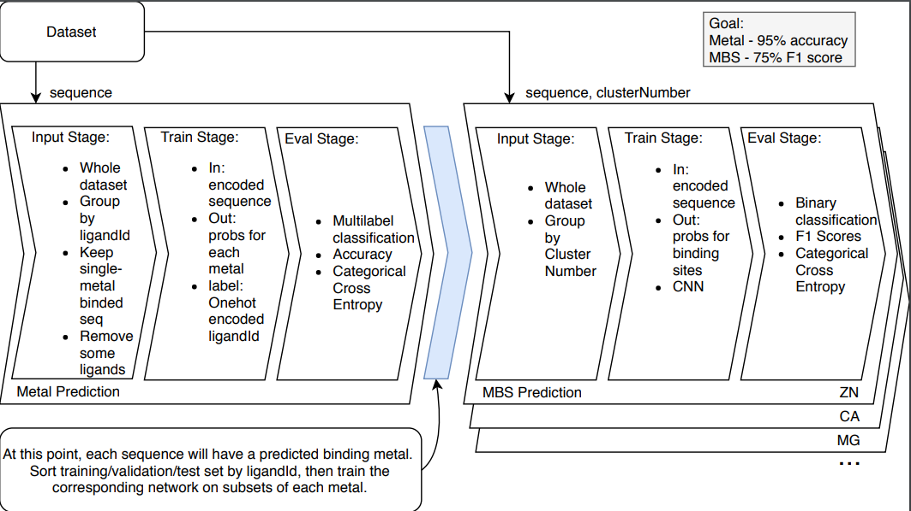

# Protein Metal Binding Site Prediction
#### Contributors : Tian Qiu, Zihan Zheng, Lowan Haeuk Kim
### Biological Significance :
Proteins and their structures are the key to biological functions in life.
Through translation, ribosomes will elongate amino acid sequence chain, and
these amino acid's physicochemical properties and their interdependencies
with each other allows the primary structure to fold into its complex tertiary
structure.

Once the structure is established, protein structure may allow for certain ions
to bind, which may cause the structure to be more stabilized through
conformational change, or aid in catalysis. For example, zinc fingers
stabilizing the structure, or the necessity of ion in heme group in order for
hemoglobin to transport oxygen.

Additionally, the fact that binding sites’ sequences and structures tend to be
conserved throughout generations, and about 1/3 of protein structures from
Protein Data Bank (PDB) contain metal ions may indicate that it significantly
intervenes in proteins behavior.

### Goal :
It is our interest to utilize a prominent neural networks to identify which
metals bind to which sequence, and also which amino acid that the metal
specifically binds to.

We aim to classify the metals to sequence of accuracy of 95%.  
We aim to classify which amino acids binds to the metal of F1 score of 75%.

### General Outline :

[ This project is divided into two main parts : (Left) Part A - predicting which
metal binds to the sequence - is divided into three main parts as it is shown.
By end of Part A, the predicted metals are appended to the copy of original
dataset and passed it on the next step. (Right) Part B - Predicts which
amino acids within the sequence actually binds to the predicted metal -
similarly, is divided into three parts as it is shown in the diagram. It will
cluster the data by the predicted metals from Part A, and call the corresponding
metal specific Convolutional Neural Network (with FOFE encoding) to train on
(Total 8 metal specific CNNs), then the actual evaluation of the network. ]
  
## The Repository
[datasets:](https://github.com/sbl-sdsc/metal-binding-prediction/tree/master/datasets) contains all required parquet data files.
* **Metal_all_20180116.snappy.parquet** - is the raw dataframe
* **Metal_all_20180601.parquet** - is the processed dataframe
* **Metal_all_20180601_predicted.parquet** - is the processed dataframe with predicted ligandId for all sequences

[dictionaries:](https://github.com/sbl-sdsc/metal-binding-prediction/tree/master/dictionaries) contains all dictionaries for sequence encoding.

[logs:](https://github.com/sbl-sdsc/metal-binding-prediction/tree/master/logs) contains trained F1 score records as charts (*.png) and data (results.txt)
* **results.txt** - format: phrase,LigandID,optimizer,learningrate,lossfunction,threshold for MBS prediction,#epochs,F1

[models:](https://github.com/sbl-sdsc/metal-binding-prediction/tree/master/models) contains all saved models (*.json) and weights (*.h5) for all ligandIds. These are used with Keras.

[root folder:](https://github.com/sbl-sdsc/metal-binding-prediction)
* [modules.py](https://github.com/sbl-sdsc/metal-binding-prediction/blob/master/modules.py) stores all functions (encoded data generators, trainer, etc)

* [metal_prediction.ipynb](https://github.com/sbl-sdsc/metal-binding-prediction/blob/master/metal_prediction.ipynb) train a keras model that predicts what type of metal ion a sequence binds to (first step)

* [MBS_prediction.ipynb](https://github.com/sbl-sdsc/metal-binding-prediction/blob/master/MBS_prediction.ipynb) train a keras model that predicts where in a sequence a metal ion binds to (second step)

* [predictor.ipynb](https://github.com/sbl-sdsc/metal-binding-prediction/blob/master/predictor.ipynb) does the prediction for both steps (metal type and fingerprints)

## Run the Program
On the Notebook : [predictor.ipynb](https://github.com/sbl-sdsc/metal-binding-prediction/blob/master/predictor.ipynb)
You can import your own dataset.

 
On the Terminal :
> python3 predictor.py [index(0,58206)]
